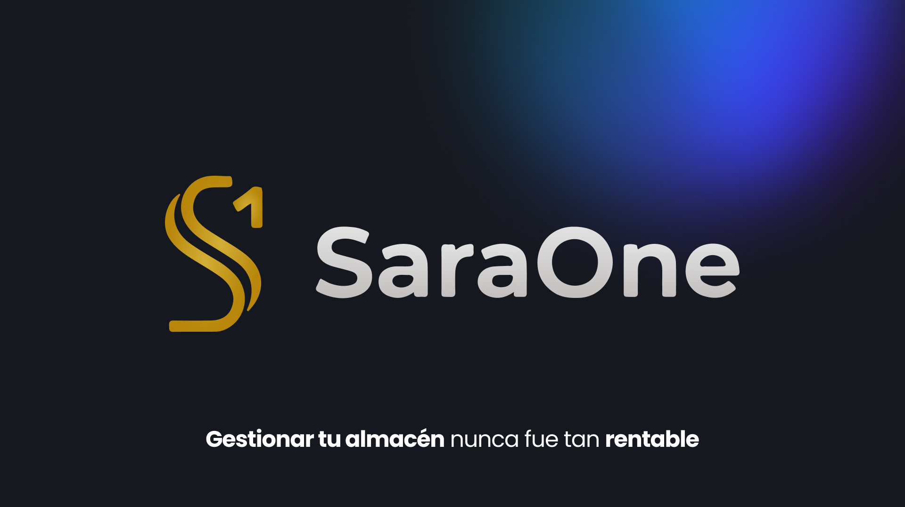

## 📋 Descripción

Proyecto de Arquitectura de Software que implementa un sistema distribuido para la gestión y control de robots autónomos. El sistema consta de tres componentes principales:


- **Backend (C++)**: Servidor WebSocket que gestiona la lógica de negocio, mapas, tareas y estados de robots
- **Frontend (Vue. js)**: Interfaz web interactiva para visualización y control
- **Router (Python)**: Simulador de movimiento de los robots que se comunica con el backend

## 🏗️ Arquitectura

```
┌─────────────┐         WebSocket          ┌─────────────┐
│   Frontend  │◄──────────────────────────►│   Backend   │
│   (Vue.js)  │      ws://localhost:8080   │    (C++)    │
└─────────────┘                            └──────┬──────┘
                                                  │
                                                  │ WebSocket
                                                  │
                                           ┌──────▼──────┐
                                           │   Router    │
                                           │  (Python)   │
                                           └─────────────┘
```

## 🚀 Tecnologías

### Backend
- **Lenguaje**: C++17
- **Build System**: CMake
- **Bibliotecas**:
  - [IXWebSocket](https://github.com/machinezone/IXWebSocket) - Servidor WebSocket
  - [nlohmann/json](https://github.com/nlohmann/json) - Procesamiento JSON
- **Arquitectura**: Patrón State para gestión de estados de robots

### Frontend
- **Framework**: Vue 3.5
- **Build Tool**: Vite 7
- **Estilos**: TailwindCSS 3.4
- **WebSocket**: Cliente nativo (ws)
- **Node.js**: ^20.19.0 || >=22.12.0

### Router
- **Lenguaje**: Python 3
- **Biblioteca**: websockets, asyncio

## 📦 Instalación

### Prerrequisitos

- **Backend**:
  - CMake >= 3.10
  - Compilador C++17 (recomendado:  MSYS2 MINGW64 en Windows, GCC/Clang en Unix)
  - Make

- **Frontend**:
  - Node.js >= 20.19.0
  - npm

- **Router**:
  - Python 3.7+
  - pip

### Backend

```bash
cd backend

# Compilación con CMake
mkdir build && cd build
cmake ..
make

# O usando el Makefile directo
cd backend
make
```

**Nota para Windows**: Se recomienda usar [MSYS2 MINGW64](https://www.msys2.org/) para compilar. 

### Frontend

```bash
cd frontend

# Instalar dependencias
npm install

# Modo desarrollo
npm run dev

# Build para producción
npm run build
```

### Router (Simulador de Movimiento de Robots)

```bash
cd router

# Instalar dependencias
pip install websockets

# Ejecutar simulador
python RobotRouter.py
```

## 🎯 Uso

### 1. Iniciar el Backend

```bash
cd backend/build
./server
```

El servidor WebSocket se ejecutará en `ws://localhost:8080`

### 2. Iniciar el Frontend

```bash
cd frontend
npm run dev
```

La interfaz web estará disponible en `http://localhost:5173` (puerto por defecto de Vite)

### 3. Conectar el Simulador de Movimiento de Robots (opcional)

```bash
cd router
python RobotRouter. py
```

El simulador enviará mensajes de heartbeat cada segundo y escuchará respuestas del servidor.

## 📁 Estructura del Proyecto

```
PAE-2025/
├── backend/                 # Servidor C++
│   ├── src/
│   │   ├── app/            # Lógica principal de la aplicación
│   │   ├── common/         # Clases comunes (Map, etc.)
│   │   ├── controllers/    # Controladores
│   │   ├── robots/         # Gestión de robots y estados
│   │   ├── services/       # Servicios (Map, Robot, Task)
│   │   ├── tasks/          # Sistema de tareas
│   │   ├── POIs/           # Puntos de interés
│   │   └── WebSocket/      # Implementación WebSocket
│   ├── third_party/        # Dependencias externas
│   ├── CMakeLists.txt
│   └── Makefile
│
├── frontend/               # Cliente web Vue.js
│   ├── src/
│   │   ├── assets/        # Recursos estáticos
│   │   ├── components/    # Componentes Vue
│   │   └── ... 
│   ├── public/
│   ├── index.html
│   ├── package.json
│   ├── vite.config.js
│   └── tailwind.config.js
│
├── router/                 # Simulador de robot
│   └── RobotRouter.py
│
├── license.txt            # Licencia del proyecto
└── README.md              # Este archivo
```

## 🛠️ Desarrollo

### Backend

El backend está organizado siguiendo principios SOLID:

- **Services**: Interfaz de servicios (MapService, RobotService, TaskService)
- **Controllers**: Manejo de peticiones
- **State Pattern**: Gestión de estados de robots (WorkingState, etc.)

### Frontend

Proyecto Vue 3 con Composition API:

```bash
# Modo desarrollo con hot-reload
npm run dev

# Preview del build de producción
npm run preview
```

## 🤝 Contribución

1. Fork el proyecto
2. Crea una rama para tu feature (`git checkout -b feature/AmazingFeature`)
3. Commit tus cambios (`git commit -m 'Add some AmazingFeature'`)
4. Push a la rama (`git push origin feature/AmazingFeature`)
5. Abre un Pull Request

## 📄 Licencia

Este proyecto está bajo una licencia incluida en el archivo `license.txt`.

## 👥 Autores

- [@Alex Meca Moñino](https://github.com/MeLlamanMeca)
- [@Alejandro Ruiz Patón](https://github.com/alrupaa)
- [@Matteo Verdaguer Marchesin](https://github.com/matteuvf)
- [@Alexandre Vinent Padrol](https://github.com/xelavi)

## 📞 Contacto

Para preguntas o sugerencias, por favor abre un [issue](https://github.com/MeLlamanMeca/PAE-2025/issues).

---

⭐ Si este proyecto te fue útil, considera darle una estrella en GitHub

